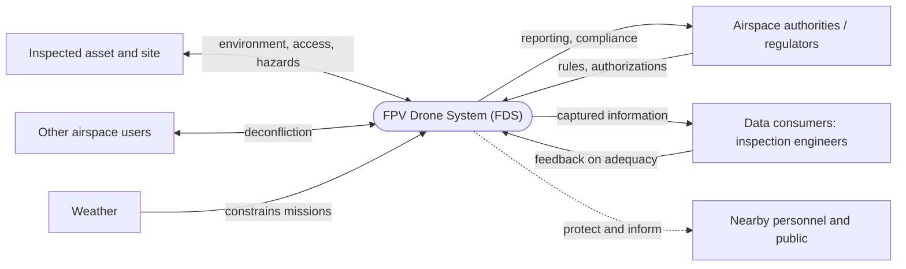
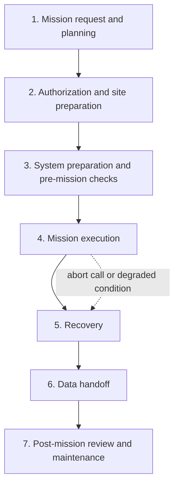

[README.md](https://github.com/user-attachments/files/33228894/README.md)
# FPV-Drone-Systems-Engineering# FPV Drone System for Remote Visual Inspection: Systems Engineering Case Study

A graduate-level systems engineering case study that follows a First-Person-View (FPV) Drone System (FDS) from problem definition through stakeholder needs and a Concept of Operations. The deliverables are built to show clear traceability from the problem to needs to operational scenarios, using solution-neutral language throughout.

> **Context:** Graduate coursework, M.S. in Systems Engineering, California State University, Dominguez Hills (CSUDH). Introduction to Systems Engineering (SEE 510), Fall 2026.
> **Author:** Anthony Akor

## System of Interest

An FPV drone system used by a trained operator to inspect infrastructure and industrial assets (structures, tanks, energy facilities, confined or elevated spaces) without sending people into hazardous locations. The case study does not assume the FDS is the only or best solution. Crawler platforms, tethered systems, conventional aerial platforms, permanent sensors, and human-led access are treated as alternatives to be compared later.

## System at a Glance

**System context:** the FDS and the external entities it interacts with.



**Normal mission sequence:**



## Deliverables

| ID | Deliverable | Status |
|----|-------------|--------|
| EDC 1 | System definition, stakeholder needs, Statement of Need, and CONOPS | Complete: see [`docs/EDC1_System_Definition_and_CONOPS.md`](docs/EDC1_System_Definition_and_CONOPS.md) |
| EDC 2 | Measures, functional analysis, and requirements | Planned |
| EDC 3 | To be added | Planned |

This repository will grow as each deliverable is completed.

## What EDC 1 Covers

- **System definition:** purpose, mission, capability gap, scope, assumptions (A-01 to A-05), constraints (C-01 to C-06), and uncertainties (U-01 to U-05)
- **Stakeholders and needs:** 9 stakeholders (SH-01 to SH-09) and 15 solution-neutral needs (SN-01 to SN-15)
- **Statement of Need:** outcome-focused, with a quality check
- **CONOPS:** normal mission sequence, 6 operational scenarios, operating modes, external interactions, and life-cycle considerations
- **Integration check:** progression check, need-to-scenario traceability matrix, and consistency checklist

## Repository Structure

```
.
├── README.md
├── docs/
│   └── EDC1_System_Definition_and_CONOPS.md
└── pdf/
    └── EDC1_System_Definition_and_CONOPS.pdf   (add your PDF here)
```

## Notes

- Regulatory references reflect 14 CFR Part 107 as in effect at the time of writing. The proposed 14 CFR Part 108 (BVLOS) rule had not been finalized, and its outcome is tracked as an open uncertainty (U-03).
- This is academic work and not an engineering design for operational use or a substitute for a site safety program.
